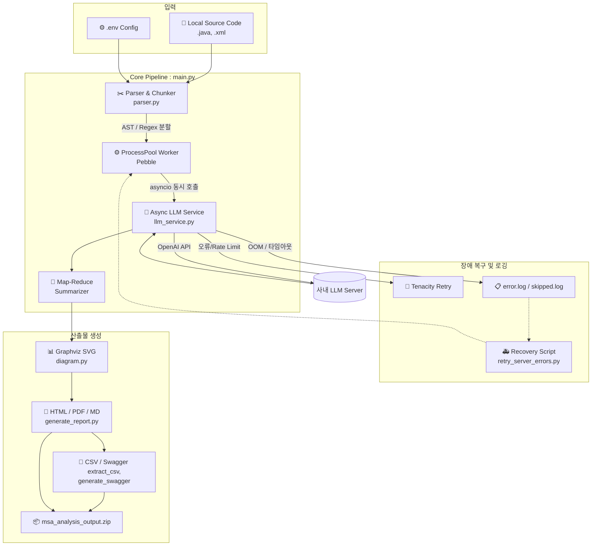

# 🚀 Legacy-to-MSA Automator (레거시 to MSA 자동 분석 파이프라인)


-412991?logo=openai&logoColor=white)


## 📖 소개 (About the Project)
본 프로젝트는 방대한 모놀리식(Monolithic) 시스템의 소스 코드(Java, XML)를 자동으로 분석하여 **마이크로서비스 아키텍처(MSA) 전환을 위한 도메인 설계도와 리팩토링 가이드를 제공하는 엔터프라이즈급 AI 자동화 파이프라인**입니다. 

단순한 API 호출 스크립트를 넘어, 대규모 파일을 분석하기 위한 **AST 기반 지능형 청킹(Chunking)**, 속도 극대화를 위한 **멀티프로세싱 + 비동기(Async) 하이브리드 아키텍처**, 그리고 사내 LLM 서버의 VRAM OOM(메모리 초과) 현상을 방어하는 **강력한 자동 복구 및 타임아웃 제어 로직**이 탑재되어 있습니다.

## ✨ 주요 기능 (Features)
- **AST & 정규식 기반 지능형 파일 분할 (Chunking)**: 3,000줄이 넘는 대용량 파일도 토큰 초과 오류 없이 Java 메서드 단위, XML 쿼리 태그 단위로 쪼개어 분석 후 Map-Reduce 방식으로 병합합니다.
- **하이브리드 병렬 처리 (Performance)**: `Pebble` 프로세스 풀로 CPU 바운드 작업을 분산하고, 분할된 청크들은 `asyncio.gather`를 통해 비동기로 동시 호출하여 분석 속도를 극대화합니다.
- **강력한 무결점 방어 로직 (Resilience)**: 
  - 지수 백오프(Exponential Backoff) 재시도
  - 파일 락(File Lock) 기반 안전한 동시성 로깅
  - LLM 서버 크래시(OOM) 및 무한 대기(Deadlock) 타임아웃 감지 및 워커 자동 교체
- **시각화 및 산출물 자동화 (Reporting)**: Graphviz 의존성 다이어그램(SVG) 로컬 렌더링을 지원하며, 분석이 끝나면 HTML/PDF/MD 리포트, CSV 데이터 추출, OpenAPI(Swagger) 명세서 등을 자동 생성하고 **ZIP 파일로 압축**하여 공유를 돕습니다.
- **스마트 복구 시스템 (Recovery)**: 서버 다운이나 타임아웃으로 실패한 파일들만 쏙쏙 골라내어 재시도하는 복구 스크립트(`retry_server_errors.py`)를 제공합니다.

---

## 🏗️ 시스템 아키텍처 (System Architecture)



---

## ⚙️ 시스템 요구 사항 (Prerequisites)

파이썬 패키지 외에, 로컬 PC나 서버의 **운영체제(OS) 레벨에 반드시 설치되어야 하는 필수 프로그램**입니다.

- Python 3.9 이상
- **Graphviz**: 아키텍처 다이어그램 로컬 렌더링용 (※ 설치 시 반드시 `Add Graphviz to the system PATH` 체크)
- **wkhtmltopdf**: HTML을 PDF 리포트로 변환하기 위한 엔진 (설치 후 환경변수 PATH 추가 또는 `generate_report.py` 내에 경로 직접 지정 필요)
- 사내 LLM 접근 권한 (`LLM_BASE_URL`, `LLM_API_KEY`)

---

## 🚀 설치 및 초기 설정 (Installation & Setup)
**1. 패키지 설치**
```bash
pip install -r requirements.txt
```

**2. 환경 변수(`.env`) 설정**
프로젝트 루트 디렉토리에 `.env` 파일을 생성하고 아래 내용을 본인의 환경에 맞게 작성합니다.

```dotenv
# 1. 분석할 로컬 소스 코드 경로 (SVN/Git 체크아웃 폴더 등)
SOURCE_DIRECTORY=C:/path/to/your/monolith_source

# 2. 사내 LLM (Qwen 3.5 등) API 설정
LLM_BASE_URL=http://your-internal-llm-server/v1
LLM_API_KEY=your_internal_llm_api_key
LLM_MODEL_NAME=qwen3.5

# 3. 분석 제외 경로 (쉼표로 구분)
EXCLUDE_PATHS=com/example/common,src/test

# 4. 성능 튜닝 (PC 및 서버 스펙에 맞게 조절)
LLM_MAX_WORKERS=5                # 동시에 분석할 파일(프로세스) 개수 (OOM 발생 시 2~3으로 하향)
WORKER_TIMEOUT_SECONDS=300       # 개별 파일 분석 최대 허용 시간 (초 단위)
ASYNC_CHUNK_CONCURRENCY=3        # 대용량 Java/XML 분할 시, 1개 파일 내 동시 비동기 요청 수
ASYNC_CHUNK_CONCURRENCY_SQL=1    # 대용량 DDL(.sql) 분할 시, 동시 비동기 요청 수 (VRAM 보호를 위해 1 권장)
```

**3. 사내 폐쇄망(Offline) 설치 가이드 (선택)**
사내 Nexus(PyPI 프록시)에 `Pebble`, `javalang` 등이 차단되어 설치가 안 되는 경우:
- **오프라인 반입**: 인터넷이 되는 외부 PC에서 `pip download -r requirements.txt -d ./offline_pkg` 실행 후 사내망으로 가져와 `pip install --no-index --find-links=./offline_pkg -r requirements.txt` 실행
- **내장 모듈 우회**: `javalang`은 설치하지 못해도 단순 분할로 자동 우회(Fallback)되므로 에러 없이 그대로 사용 가능합니다.

---

## 📖 사용 설명서 (User Guide)

### 1. DB 스키마(DDL) 추출 및 세팅 (권장)
정확한 데이터베이스 분리와 마이그레이션 우선순위 분석을 위해 ERD에서 DDL을 추출합니다.
1. SQL Developer Data Modeler에서 `.dmd` 파일을 엽니다.
2. `File` -> `Export` -> `DDL File`을 통해 `.sql` 스크립트를 추출합니다.
3. 추출된 `.sql` 파일을 `SOURCE_DIRECTORY` 폴더 안에 넣습니다.

### 2. 파이프라인 분석 실행
터미널에서 아래 명령어를 실행하여 분석을 시작합니다.
```bash
python main.py
```
* **자동 재개 (Checkpoint)**: 중단되더라도 다시 실행하면 이미 분석된 파일은 1초 만에 `[SKIP]` 처리되므로 이어서 분석이 가능합니다.

### 3. 결과물 확인 및 공유
파이프라인이 100% 완료되면 루트 디렉토리에 다음 산출물들이 자동 생성됩니다.
* **`msa_analysis_output.zip`**: 모든 산출물이 예쁘게 압축된 공유용 파일입니다.
* **CSV 엑셀 추출물**: `domain_table_mapping.csv` (DB 마이그레이션 팀용), `service_dependencies.csv` (의존성 분석용), `api_endpoints.csv` (엔드포인트 추출용)
* **리포트**: `msa_analysis_report.html` (웹 브라우저 인터랙티브 리포트), `msa_analysis_report.pdf`, `merged_msa_report.md`

### 4. 서버 장애 누락분 자동 복구 (Recovery)
사내 LLM 서버의 VRAM 부족(OOM)이나 타임아웃으로 분석이 실패한 파일들만 모아서 빠르게 재분석합니다.
```bash
python retry_server_errors.py
```

### 5. 프로젝트 산출물 초기화 (Clean)
테스트로 생성된 모든 분석 결과(리포트, 로그, CSV, ZIP 등)를 삭제하고 초기 상태로 되돌립니다.
```bash
python clean.py
```

---

## 🕵️‍♂️ 트러블슈팅 (Troubleshooting)

- **`[⚠️ PDF 생성 실패]`**: OS에 `wkhtmltopdf`가 설치되어 있지 않거나 환경변수(PATH)에 등록되지 않았습니다.
- **다이어그램 자리에 코드(dot)가 그대로 출력될 때**: OS에 `Graphviz`가 설치되지 않았거나, 설치 시 "Add to PATH" 체크박스를 누락한 경우입니다. 재설치 후 터미널을 재시작하세요.
- **VRAM OOM (502/503 에러) 발생 시**: `.env` 파일의 `LLM_MAX_WORKERS`를 2 정도로 줄이고, 타임아웃을 600초로 늘려 서버 부하를 낮추세요. 상세 로그는 `error.log` 파일에서 확인할 수 있습니다.