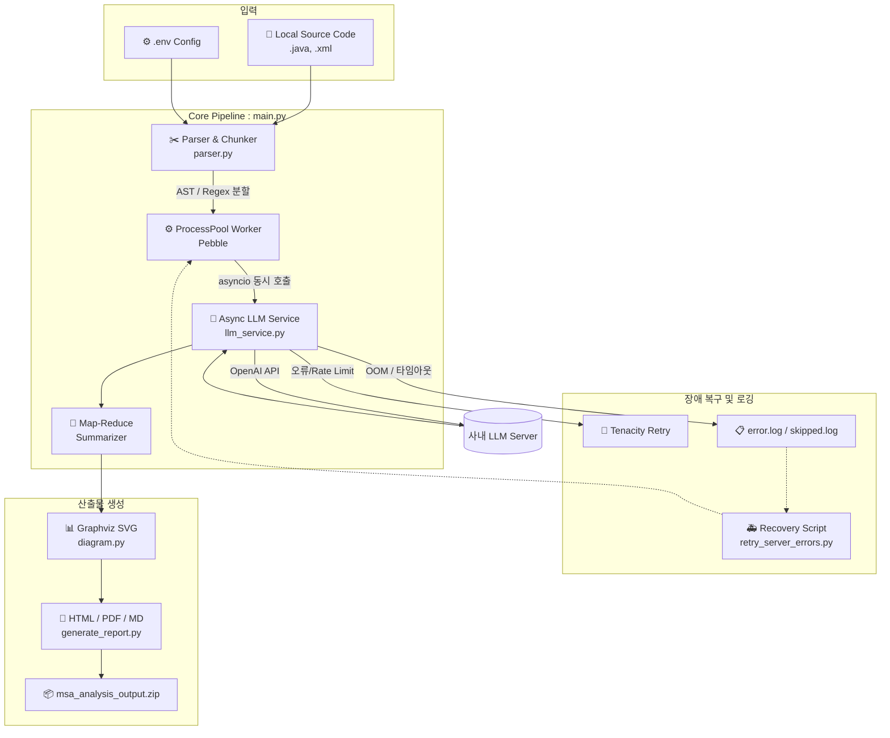

# 🚀 Legacy-to-MSA Automator (레거시 to MSA 자동 분석 파이프라인)


-412991?logo=openai&logoColor=white)


## 📖 소개 (About the Project)
본 프로젝트는 방대한 모놀리식(Monolithic) 시스템의 소스 코드(Java, XML)를 자동으로 분석하여 **마이크로서비스 아키텍처(MSA) 전환을 위한 도메인 설계도와 리팩토링 가이드를 제공하는 엔터프라이즈급 AI 자동화 파이프라인**입니다. 

단순한 API 호출 스크립트를 넘어, 대규모 파일을 분석하기 위한 **AST 기반 지능형 청킹(Chunking)**, 속도 극대화를 위한 **멀티프로세싱 + 비동기(Async) 하이브리드 아키텍처**, 그리고 사내 LLM 서버의 VRAM OOM(메모리 초과) 현상을 방어하는 **강력한 자동 복구 및 타임아웃 제어 로직**이 탑재되어 있습니다.

## ✨ 주요 기능 (Features)
- **AST & 정규식 기반 지능형 파일 분할 (Chunking)**: 3,000줄이 넘는 대용량 파일도 토큰 초과 오류 없이 Java 메서드 단위, XML 쿼리 태그 단위로 쪼개어 분석 후 Map-Reduce 방식으로 병합합니다.
- **하이브리드 병렬 처리 (Performance)**: `Pebble` 프로세스 풀로 CPU 바운드 작업을 분산하고, 분할된 청크들은 `asyncio.gather`를 통해 비동기로 동시 호출하여 분석 속도를 극대화합니다.
- **강력한 무결점 방어 로직 (Resilience)**: 
  - 지수 백오프(Exponential Backoff) 재시도
  - 파일 락(File Lock) 기반 안전한 동시성 로깅
  - LLM 서버 크래시(OOM) 및 무한 대기(Deadlock) 타임아웃 감지 및 워커 자동 교체
- **시각화 및 산출물 자동화 (Reporting)**: Graphviz를 이용한 의존성 다이어그램(SVG) 로컬 렌더링을 지원하며, 분석이 끝나면 HTML, PDF, 통합 Markdown 리포트를 생성하고 **자동으로 ZIP 파일로 압축**하여 공유를 돕습니다.
- **스마트 복구 시스템 (Recovery)**: 서버 다운이나 타임아웃으로 실패한 파일들만 쏙쏙 골라내어 재시도하는 복구 스크립트(`retry_server_errors.py`)를 제공합니다.

---

## 🏗️ 시스템 아키텍처 (System Architecture)



---

## ⚙️ 시스템 요구 사항 (Prerequisites)

파이썬 패키지 외에, 로컬 PC나 서버의 **운영체제(OS) 레벨에 반드시 설치되어야 하는 필수 프로그램**입니다.

- Python 3.9 이상
- **Graphviz**: 아키텍처 다이어그램 로컬 렌더링용 (※ 설치 시 반드시 `Add Graphviz to the system PATH` 체크)
- **wkhtmltopdf**: HTML을 PDF 리포트로 변환하기 위한 엔진 (설치 후 환경변수 PATH 추가 또는 `generate_report.py` 내에 경로 직접 지정 필요)
- 사내 LLM 접근 권한 (`LLM_BASE_URL`, `LLM_API_KEY`)

---

## 🚀 설치 및 초기 설정 (Installation & Setup)

**1. 저장소 클론 및 패키지 설치**
```bash
pip install -r requirements.txt
```